# Backend — Sombra digital de reslotting, CD Aldeas

Documentación técnica del backend en `MVP-Inchape/backend/`: cómo está armado, qué reglas de negocio tiene y cómo se relacionan los datos. Complementa (no repite) `Documentacion Claude/plan-desarrollo-mvp-react-fastapi.md`, que es el plan de trabajo; este documento describe el código **tal como quedó construido**.

---

## 1. Qué hace este backend, en una frase

Recibe el Excel del CD (o, en producción, exports CSV de SAP MM/WMS Brainsys), valida y persiste un lote de datos, y expone un pipeline que calcula — con reglas de negocio editables, un score ponderado, optimización matemática, perfil de SKU por Machine Learning y un motor de afinidad — una recomendación de zona por SKU, siempre explicable, nunca escrita automáticamente a un sistema de producción.

```
Excel/CSV ──POST /ingesta──▶ SQLite (lote vigente) ──POST /pipeline/ejecutar──▶ Recomendación por SKU
                                    │                        │
                            GET /zonas (geometría)    Reglas activas (GET/POST/PUT/DELETE /reglas)
                                                       KMeans + afinidad (GET /afinidad)
                                                       Explicabilidad (GET /recomendaciones/{sku})
                                                       Ergonomía NIOSH (GET /ergonomia)
```

Persona revisa la recomendación y la aplica manualmente en el WMS — el backend nunca escribe a SAP/WMS. Es la definición de **sombra**, no de gemelo digital.

---

## 2. Stack y arquitectura de capas

| Capa | Carpeta | Responsabilidad |
|---|---|---|
| API | `app/api/routers/` | HTTP únicamente: recibe request, llama a `dominio/`, traduce excepciones a códigos HTTP. Sin lógica de negocio. |
| Dominio | `app/dominio/` | Funciones puras sobre `pandas.DataFrame`. No conocen HTTP ni SQL. Es el "cerebro" — reglas, score, optimización, ML, afinidad. |
| Ingesta | `app/ingesta/` | Mapeo configurable + validación de datos entrantes. |
| Persistencia | `app/core/db.py` | Esquema SQLite (SQLAlchemy Core) + acceso al lote vigente. |
| Esquemas | `app/schemas/` | Contratos Pydantic de request/response (independientes de las estructuras internas de `dominio/`). |

Framework: **FastAPI** + **SQLAlchemy Core** sobre **SQLite**. Optimización: **PuLP** (solver CBC). ML: **scikit-learn** (KMeans). Afinidad: **NetworkX** + **python-louvain** + **mlxtend**. Todo corre en el entorno conda `IngenieriaPython` (`MVP-Inchape/environment.yml`).

### 2.1 Principio rector: nunca caja negra, nunca dato inventado

Dos reglas se repiten en todo el código y son la clave para entenderlo:

1. **Toda recomendación es descomponible.** El score es una suma ponderada explícita (no una red neuronal), las reglas duras que descartan una zona quedan registradas (`camino_decision_reglas`), y el cluster ML se explica variable por variable, no como una etiqueta opaca.
2. **Ningún módulo simula con datos que no existen.** Si falta el dato que activaría una capacidad (ej. distancia real del plano, histórico de 6 meses), el módulo se declara inactivo explícitamente (`banderas_activas`) en vez de inventar un resultado. Ver §7.

---

## 3. Modelo entidad-relación

Todas las tablas viven en un único archivo SQLite (`mvp.db`), definidas en `app/core/db.py`. Se agrupan en tres bloques por su ciclo de vida:

- **Lote vigente** (`sku_maestro`, `rotacion`, `stock_actual`, `layout_cd`, `ocupacion_zona`, `pedidos`): se **reemplazan por completo** en cada `POST /ingesta` exitoso — no es una tabla incremental, es la foto del último lote cargado.
- **Estático** (`zonas`): geometría de las 13 zonas del plano vectorial, sembrada una sola vez al arrancar, independiente del lote de datos.
- **Resultado y configuración** (`reglas`, `resultados_ultimo_lote`, `lotes_ingesta`): sobreviven a través de ingestas sucesivas.
- **Nivel 2, hoy vacías** (`slotting_inicial`, `historico_mensual`, `fecha_alta_sku`, `incidentes_ergonomicos`): esquema listo desde el día uno para cuando existan datos reales del CD Aldeas (ver §7).

No hay `FOREIGN KEY` declaradas a nivel SQL (SQLite + simplicidad de un MVP de 12 días) — la integridad referencial (`SKU` de `pedidos`/`stock_actual` debe existir en `sku_maestro`) se hace cumplir en `app/ingesta/validacion.py` **antes** de persistir, no en la base de datos. Las relaciones del diagrama son lógicas, por valor de `SKU` o `ZONA`.

```mermaid
erDiagram
    SKU_MAESTRO {
        string SKU PK
        string MARCA
        string FAMILIA
        float VOLUMEN_M3
        float PESO_KG
    }
    ROTACION {
        string SKU PK
        float ROTACION_6M
        string ABC
    }
    STOCK_ACTUAL {
        int id PK
        string UBICACION
        string SKU FK
        string ZONA_ACTUAL FK
    }
    LAYOUT_CD {
        string ZONA PK
        float DISTANCIA_METROS
        float TIEMPO_MINUTOS
        float CAPACIDAD_M3_MAX
    }
    OCUPACION_ZONA {
        string ZONA PK
        float CAPACIDAD_MAX_M3
        float VOLUMEN_USADO_M3
        float VOLUMEN_DISPONIBLE_M3
        float PORCENTAJE_USO
    }
    PEDIDOS {
        int id PK
        string PEDIDO_ID
        int LINEA
        string SKU FK
        float CANTIDAD
        string ZONA_ACTUAL FK
        float TIEMPO_HOY_MIN
    }
    ZONAS {
        string id PK
        string nombre
        string clave_excel
        float distancia_m
        string ubicaciones
        int lineas_picking
        string color
        text puntos_svg
        bool texto_claro
    }
    REGLAS {
        string id PK
        string tipo
        string nombre
        text definicion_json
        bool activa
        text justificacion
    }
    RESULTADOS_ULTIMO_LOTE {
        string SKU PK
        text resultado_json
        datetime fecha_ejecucion
    }
    LOTES_INGESTA {
        int id PK
        datetime fecha_carga
        int filas_aceptadas
        int filas_rechazadas
        text resumen_json
    }
    SLOTTING_INICIAL {
        string SKU PK
        string ZONA_ASIGNADA
        datetime FECHA_ASIGNACION
        float TIEMPO_TEORICO_ORIGINAL
    }
    HISTORICO_MENSUAL {
        int id PK
        string SKU
        string MES
        int HITS
    }
    FECHA_ALTA_SKU {
        string SKU PK
        datetime FECHA_ALTA
    }
    INCIDENTES_ERGONOMICOS {
        int id PK
        string SKU
        string ZONA
        datetime FECHA
        text DESCRIPCION
    }

    SKU_MAESTRO ||--o| ROTACION : "SKU (logico)"
    SKU_MAESTRO ||--o{ STOCK_ACTUAL : "SKU (logico)"
    SKU_MAESTRO ||--o{ PEDIDOS : "SKU (logico)"
    SKU_MAESTRO ||--o| RESULTADOS_ULTIMO_LOTE : "SKU (logico)"
    LAYOUT_CD ||--o{ STOCK_ACTUAL : "ZONA_ACTUAL (logico)"
    LAYOUT_CD ||--o{ PEDIDOS : "ZONA_ACTUAL (logico)"
    LAYOUT_CD ||--|| OCUPACION_ZONA : "ZONA (logico)"
    SKU_MAESTRO ||--o| SLOTTING_INICIAL : "SKU -- Nivel 2, vacia"
    SKU_MAESTRO ||--o{ HISTORICO_MENSUAL : "SKU -- Nivel 2, vacia"
    SKU_MAESTRO ||--o| FECHA_ALTA_SKU : "SKU -- Nivel 2, vacia"
    SKU_MAESTRO ||--o{ INCIDENTES_ERGONOMICOS : "SKU -- Nivel 2, vacia"
```



### 3.1 Qué representa cada tabla

| Tabla | Origen | Fila = | Notas |
|---|---|---|---|
| `sku_maestro` | Hoja `MAESTRO_SKUs` | Un SKU | Atributos físicos estáticos (peso, volumen, marca, familia) |
| `rotacion` | Hoja `ROTACIÓN` | Un SKU | Rotación declarada y clase ABC — **no usar como criterio de velocidad**, no correlaciona con hits reales (Pearson 0.028, ver `CLAUDE_1.md` #2) |
| `stock_actual` | Hoja `STOCK_ACTUAL` | Una ubicación física | Dónde está hoy cada SKU |
| `layout_cd` | Hoja `LAYOUT_CD` | Una zona (9 en el dataset de práctica) | Distancia/tiempo/capacidad — la unidad de asignación del optimizador |
| `ocupacion_zona` | Hoja `OCUPACION_POR_ZONA` | Una zona | Capacidad usada/disponible reportada |
| `pedidos` | Hoja `PEDIDOS ACTUAL` | Una línea de pedido | 1500 líneas / 435 pedidos en el dataset de práctica; es la fuente real de "hits" |
| `zonas` | `data/zonas.json` (portado de `V1 planta-cd-aldeas-vectorial.html`) | Una zona geométrica (13, distintas de las 9 de `layout_cd`) | Polígono SVG para el plano interactivo del frontend — **no confundir con `layout_cd`**: son dos granularidades distintas ("Antes" del Excel vs. "Ahora" del plano real, ver `CLAUDE_1.md` #8) |
| `reglas` | Editada por el usuario vía API | Una regla de negocio | `definicion_json` guarda el payload específico según `tipo` (§4) |
| `resultados_ultimo_lote` | Escrita por `POST /pipeline/ejecutar` | Un SKU | Snapshot de la última recomendación calculada |
| `lotes_ingesta` | Escrita por `POST /ingesta` | Una carga de archivo | Trazabilidad: cuántas filas se aceptaron/rechazaron por lote |
| `slotting_inicial`, `historico_mensual`, `fecha_alta_sku`, `incidentes_ergonomicos` | Nivel 2 (no existen en el dataset de práctica) | — | Esquema listo, vacías; activan capacidades nuevas sin cambiar código (§7) |

---

## 4. Motor de reglas de negocio

Vive en `app/dominio/reglas/` (`modelos.py`, `evaluador.py`, `repositorio.py`) y se conecta al optimizador en `app/dominio/pipeline.py`. **No usa ninguna librería externa de reglas** (se evaluó y se descartó `business-rules` por riesgo de mantenimiento) — es un evaluador propio con un mapa fijo de operadores seguros (`==`, `!=`, `>`, `>=`, `<`, `<=`), nunca `eval()`.

Hay 3 tipos de regla, cada uno con su propia forma de `definicion` (validada por Pydantic; un `model_validator` impide guardar una regla cuyo `tipo` no coincida con la forma de su `definicion`):

### 4.1 Regla de atributo — condición sobre un campo del SKU

Fuerza o prohíbe una zona para los SKU que cumplen una condición.

```json
{
  "id": "R-001",
  "tipo": "atributo",
  "nombre": "Correas al piso",
  "definicion": {
    "campo": "FAMILIA",
    "operador": "==",
    "valor": "Correas",
    "zona_permitida": "2. PISO",
    "zona_prohibida": null
  },
  "activa": true,
  "justificacion": "Ergonomía / peso de manejo"
}
```

- `zona_permitida`: el optimizador queda forzado a `x[SKU, zona_permitida] = 1` (el SKU **debe** terminar ahí).
- `zona_prohibida`: el optimizador fija `x[SKU, zona_prohibida] = 0` (el SKU **no puede** terminar ahí).
- Pueden coexistir varias reglas de atributo activas sobre el mismo SKU; cada coincidencia queda registrada en `camino_decision_reglas` con el `id` de la regla y el motivo.

### 4.2 Regla de incompatibilidad — dos familias no comparten zona

```json
{
  "id": "R-010",
  "tipo": "incompatibilidad",
  "nombre": "Lubricantes lejos de Filtros",
  "definicion": {
    "familia_a": "Lubricantes",
    "familia_b": "Filtros",
    "modo": "misma_zona_prohibida"
  },
  "activa": true,
  "justificacion": "Riesgo de contaminación cruzada"
}
```

Nivel 1: modo binario únicamente (`misma_zona_prohibida`) — decide si comparten zona o no, sin distancia mínima en metros, porque la geometría absoluta del plano todavía no está confirmada (§7). Se implementa en el optimizador con variables indicadoras: `y[familia, zona] = 1` si algún SKU de esa familia queda en esa zona, con `x[SKU, zona] <= y[familia(SKU), zona]` y `y[familia_a, zona] + y[familia_b, zona] <= 1` para cada zona — la linealización estándar de "no ambas a la vez".

### 4.3 Regla de umbral — filtro numérico configurable

```json
{
  "id": "R-020",
  "tipo": "umbral",
  "nombre": "Payback máximo aceptable",
  "definicion": {
    "campo_evaluado": "PAYBACK_ESTIMADO",
    "operador": "<=",
    "valor_umbral": 3,
    "accion": "no mover"
  },
  "activa": true,
  "justificacion": "Evitar mover SKU cuyo ahorro no compensa el costo del movimiento"
}
```

El evaluador (`evaluar_umbral`) ya existe y está probado, pero **todavía no está conectado al pipeline**: `PAYBACK_ESTIMADO` requiere `COSTO_REUBICACION`, que no existe en el dataset de práctica (no es siquiera un ítem del checklist Nivel 1 del plan). Se conecta el día que `dominio/scoring.py` calcule un costo de reubicación real.

### 4.4 Dónde entran las reglas en el pipeline

```
base_maestra + score
        │
        ▼
Reglas de atributo (dominio/reglas/evaluador.py::aplicar_reglas_atributo)
   → zona_unica_por_sku, zonas_excluidas_por_sku, camino_decision
Reglas de incompatibilidad (::pares_familias_incompatibles)
   → lista de pares de familia
        │
        ▼
Optimizador PuLP (dominio/optimizador.py) -- las reglas entran como
restricciones DURAS (variables fijadas a 0/1), nunca como un término
más del score: ninguna regla de seguridad es negociable por un buen score.
        │
        ▼
Recomendación final + camino_decision_reglas en la respuesta HTTP
```

### 4.5 CRUD

| Método | Ruta | Qué hace |
|---|---|---|
| `GET` | `/reglas` | Lista todas las reglas |
| `POST` | `/reglas` | Crea una regla (409 si el `id` ya existe) |
| `PUT` | `/reglas/{id}` | Reemplaza una regla (404 si no existe) |
| `DELETE` | `/reglas/{id}` | Elimina una regla (404 si no existe) |

Sin capa de aprobación/versionado — gobernanza de cambios a reglas de seguridad es un pendiente de producción, no del MVP académico (ya declarado en la propuesta original).

---

## 5. El resto del "cerebro": módulos de dominio y sus fórmulas

Todo vive en `app/dominio/`, cada archivo es un puerto directo de una fase del notebook de Valentino (`MVP_Reslotting_Inchcape.ipynb`) salvo `reglas/`, `afinidad.py` y `ergonomia.py`, que son construcción nueva de este backend.

| Módulo | Fase del notebook | Qué calcula |
|---|---|---|
| `indicadores.py` | 3 | Agrega `pedidos` (línea) a nivel SKU: `N_LINEAS`, `N_PEDIDOS`, `CANT_TOTAL`, etc. |
| `impacto.py` | 4-6 | Integra Maestro+Rotación+Stock+Pedidos+Layout → `CARGA_OPERATIVA_MIN = N_LINEAS × tiempo_zona`, `AHORRO_TEORICO_MIN = N_LINEAS × (tiempo_zona − tiempo_mínimo_CD)` |
| `scoring.py` | 7 | `SCORE_PRIORIDAD = 100 × (0.55·AHORRO_NORM + 0.20·ROTACION_NORM + 0.10·ABC_SCORE + 0.15·FACILIDAD_MOVIMIENTO)`, con `ABC_SCORE` = {A:1.0, B:0.6, C:0.3} y `FACILIDAD_MOVIMIENTO = 1 − VOLUMEN_NORM` |
| `matriz_sku_zona.py` | 8 | Producto cartesiano SKU × Zona (N×M escenarios, nunca hardcodeado) con el costo de cada combinación |
| `capacidad.py` | 9 | Volumen usado vs. capacidad máxima por zona (confirma en vivo: uso &lt;5% en el dataset de práctica) |
| `optimizador.py` | 10-11 | PuLP: minimiza tiempo total de picking sujeto a (1) una zona por SKU, (2) capacidad por zona, (3) tope de 20% de SKU movidos, (4) zonas bloqueadas, (5)-(7) reglas duras del §4 |
| `recomendaciones.py` | 12, 14 | Zona recomendada + justificación en texto por SKU; `validar_factibilidad` repite las 3 comprobaciones duras sobre el resultado ya extraído (cinturón y tirantes) |
| `kpis.py` | 13 | SKU movidos, tiempo actual vs. optimizado, % de reducción |
| `ml_perfil.py` | 18-23 | KMeans sobre 9 variables estandarizadas; K elegido por silhouette máximo (2-8); **se reentrena en cada ejecución**, no carga el `.joblib` fijo — así escala de 100 a 12,000+ SKU sin recalibrar a mano |
| `ergonomia.py` | — (nuevo) | Banda de oro NIOSH: constante genérica 23 kg, RWL favorable 21.3 kg / conservador 11.4 kg — valores ya validados en `CLAUDE_1.md` #12-14, citados como supuesto declarado, no re-derivados |
| `afinidad.py` | — (nuevo) | Lift/Jaccard por par de SKU, comunidades Louvain, test de significancia por remuestreo (200 réplicas), conjuntos frecuentes N≥3 (FP-Growth) |
| `pipeline.py` | — (orquestador) | Encadena todo lo anterior; no calcula nada por sí mismo |

### 5.1 Explicabilidad del cluster ML (sin caja negra)

`explicar_sku(sku, resultado_ml)` en `ml_perfil.py` descompone la asignación de cluster de un SKU en 4 piezas, siguiendo `propuesta-motor-reglas-y-explicabilidad.md` §5.5:

1. Perfil del centroide en variables reales (min, kg, m³ — no números escalados).
2. Contribución al cuadrado por variable: `(SKU_i − centroide_i)²`, álgebra directa de la distancia euclidiana.
3. Distancia al centroide propio vs. al segundo más cercano (¿asignación clara o ambigua?).
4. Silhouette individual del SKU (`sklearn.metrics.silhouette_samples`), no solo el promedio global.

### 5.2 Test de significancia de afinidad

`afinidad.py` nunca activa el score de afinidad por opinión. Construye pares de co-ocurrencia SKU-SKU dentro del mismo pedido, arma un grafo ponderado, corre Louvain y obtiene una modularidad observada. El nulo de referencia se construye permutando la columna `SKU` de las líneas de pedido 200 veces (conserva el tamaño de cada pedido y la popularidad marginal de cada SKU, destruye solo qué SKU concretos coincidieron) y recalculando la modularidad en cada réplica:

```python
usar_afinidad = modularidad_observada > percentil_95(modularidades_nulas)
```

Sobre el dataset de práctica: `usar_afinidad = False` (modularidad observada 0.132, percentil 95 del nulo 0.147) — coherente con el hallazgo ya documentado (`CLAUDE_1.md` #3: Nij máximo = 4, sin señal).

---

## 6. Ingesta: mapeo configurable + validación

`app/ingesta/mapeo.py` traduce nombre-de-columna-de-origen → nombre-canónico vía `data/config_mapeo.yaml`. Si mañana un export real de SAP MM trae `MATERIAL` en vez de `SKU`, se edita **solo el YAML**, nunca el código:

```yaml
sku_maestro:
  columnas:
    SKU: MATERIAL   # único cambio necesario
```

`app/ingesta/validacion.py` rechaza y reporta, nunca falla en silencio ni inventa un valor:

- Clave (`SKU`/`ZONA`) vacía → fila rechazada.
- Campo numérico no convertible → fila rechazada, valor original citado en el motivo.
- SKU en `pedidos`/`stock_actual` que no existe en `sku_maestro` → integridad referencial, fila rechazada.

`POST /ingesta` es todo-o-nada por archivo: si falta una hoja completa o una columna de origen entera, aborta con 422 antes de persistir nada (`IngestaFatalError`) — eso no es una fila sucia, es un archivo que no corresponde a lo esperado.

---

## 7. Banderas de activación por módulo (Nivel 1 → Nivel 2)

`app/core/flags.py` generaliza el patrón ya validado con la afinidad: cada capacidad que depende de un dato que hoy no existe se declara **inactiva explícitamente**, nunca se simula.

| Bandera | Hoy (dataset de práctica) | Se activa cuando |
|---|---|---|
| `usar_incompatibilidad_geometrica` | `False` (fija) | Exista cota real del plano + punto I/O confirmado — el pendiente más citado del proyecto |
| `usar_triage` | `False` | `slotting_inicial` tenga filas |
| `usar_payback_real` | `False` | `historico_mensual` tenga filas |
| `usar_fifo` | `False` | `stock_actual` tenga columna `FECHA_LOTE` |

`POST /pipeline/ejecutar` devuelve estas 4 banderas en `banderas_activas` en cada respuesta — el frontend las usa para mostrar la sección como resultado real o como "inactivo, requiere [dato]", sin lógica de negocio duplicada en el cliente.

`usar_afinidad` **no** vive aquí: correrlo cuesta ~15s (200 réplicas), así que se calcula solo dentro de `GET /afinidad`, no en cada ejecución del pipeline.

---

## 8. Referencia de endpoints

| Método | Ruta | Request | Qué devuelve |
|---|---|---|---|
| `GET` | `/salud` | — | `{"estado": "ok"}` |
| `POST` | `/ingesta` | multipart, campo `archivo` (Excel) | `filas_aceptadas`, `filas_rechazadas` (con motivo), `resumen_por_tabla` |
| `GET` | `/zonas` | — | Las 13 zonas geométricas + `distancia_absoluta_confirmada: false` |
| `POST` | `/pipeline/ejecutar` | `{pesos_score?, porcentaje_max_movimiento?}` | `recomendaciones[]`, `kpis`, `banderas_activas`, `camino_decision_reglas[]`, `ml` (K, silhouette, perfil de clusters) |
| `GET` | `/recomendaciones/{sku}` | — | Score desglosado por criterio, reglas que lo afectaron, cluster ML explicado |
| `GET` | `/reglas` | — | Lista de reglas |
| `POST` | `/reglas` | `Regla` (ver §4) | Regla creada (201) / 409 si duplicada |
| `PUT` | `/reglas/{id}` | `Regla` | Regla actualizada / 404 si no existe |
| `DELETE` | `/reglas/{id}` | — | 204 / 404 si no existe |
| `GET` | `/ergonomia` | — | Banda de oro NIOSH por SKU (favorable/conservador) |
| `GET` | `/afinidad` | — | `activo`, `motivo`, `test_significancia`, `pares[]`, `conjuntos_frecuentes[]` |

Swagger interactivo en `http://127.0.0.1:8000/docs` con el servidor corriendo.

---

## 9. Cómo correr y probar

```bash
conda activate IngenieriaPython
cd MVP-Inchape/backend
uvicorn app.main:app --reload --port 8000       # servidor de desarrollo

pytest -v                                        # 48 pruebas, todas contra el Excel real de data/
ruff check app tests && black --check app tests  # calidad de código
```

La base de datos (`mvp.db`) se crea sola al arrancar (`init_db()` + `seed_zonas_si_vacio()` en el `lifespan` de FastAPI). Las pruebas nunca tocan `mvp.db`: `tests/conftest.py` redirige `MVP_DB_PATH` a un archivo temporal por sesión de pytest.

**Nota de plataforma:** este proyecto fuerza `nomkl` (OpenBLAS en vez de MKL) en `environment.yml` — con MKL, `KMeans.fit()` crashea en Windows por un bug real de `threadpoolctl` al inspeccionar hilos de la DLL de MKL. Si se recrea el entorno desde cero, `nomkl` ya está declarado y no hace falta repetir el diagnóstico.

---

## 10. Decisiones de diseño deliberadas (y qué se dejó fuera a propósito)

- **Dominio puro + routers finos**: cada función de `dominio/` recibe y devuelve `DataFrame`/dataclasses, sin importar nada de `fastapi` ni `sqlalchemy`. Se puede probar (y de hecho se prueba) sin levantar el servidor ni tocar la base de datos.
- **Errores de negocio como excepciones tipadas**, no bools sueltos ni códigos mágicos: `BaseMaestraInvalidaError`, `MatrizSkuZonaInvalidaError`, `OptimizadorInfactibleError`, `FactibilidadError`, `SinLoteIngeridoError`, `ReglaDuplicadaError`, `ReglaNoEncontradaError`. Cada router las traduce a un código HTTP explícito (422/404/409), nunca un 500 genérico para un error de negocio esperable.
- **Capa de mapeo configurable (§6)** como el único punto que sabe de nombres de columna reales — es lo que hace que escalar del Excel de práctica a un export real de SAP no implique tocar `dominio/`.
- **KMeans se reentrena, no se carga fijo**: la alternativa (cargar el `.joblib` de Valentino) es más rápida pero rompe la promesa central del proyecto ("un solo sistema que escala por capacidad de datos, no dos sistemas distintos") en cuanto el catálogo deje de ser exactamente esos 100 SKU.
- **Sin ORM completo, SQLAlchemy Core**: para un MVP de 12 días con 14 tablas y sin relaciones complejas, un ORM añadía capas sin resolver un problema real.
- **No implementado a propósito** (no es lo mismo que "olvidado"): reglas de umbral conectadas al pipeline (falta `COSTO_REUBICACION` real), triage de re-slotting, FIFO, congestión real, geometría absoluta/ruteo — todos documentados como Nivel 2 en §7 y en `plan-desarrollo-mvp-react-fastapi.md` §11, no se construyen sin el dato real que los sustente.
